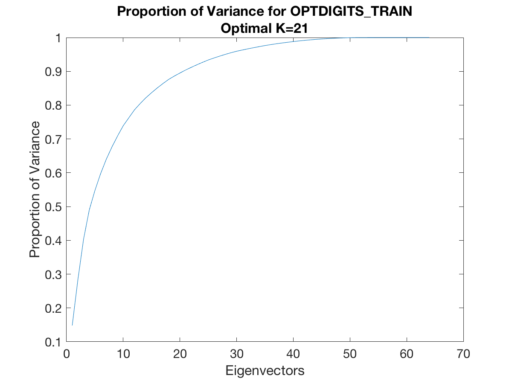
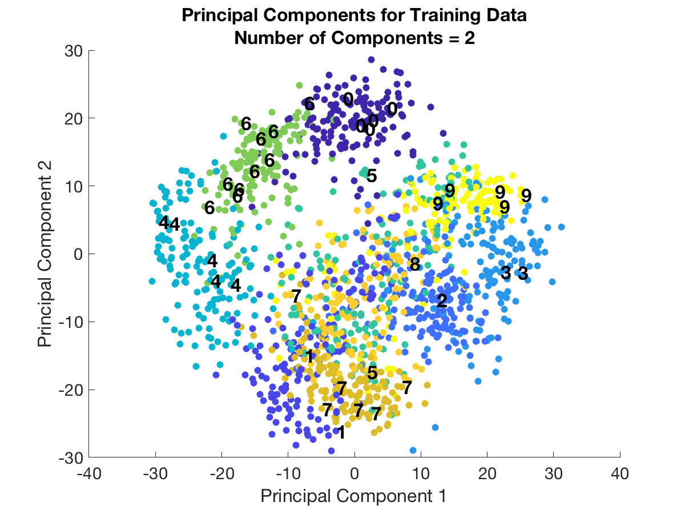
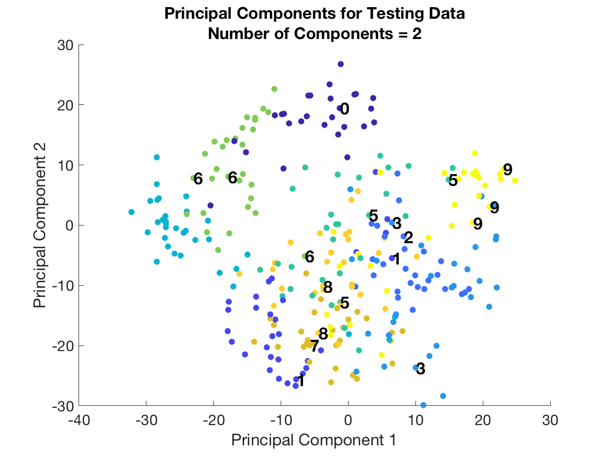
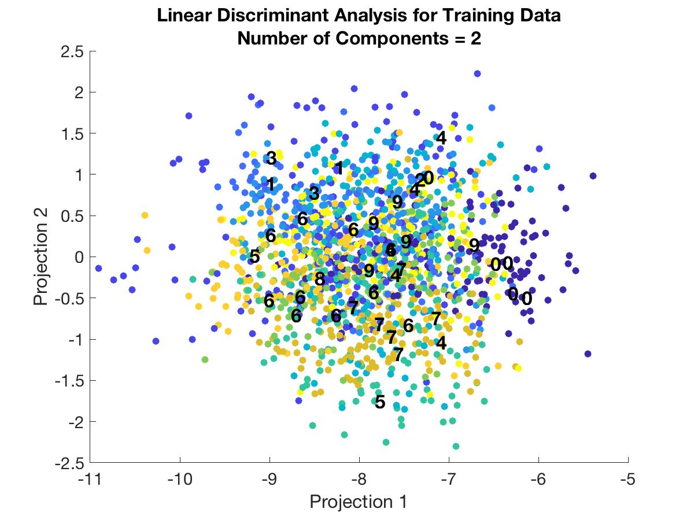
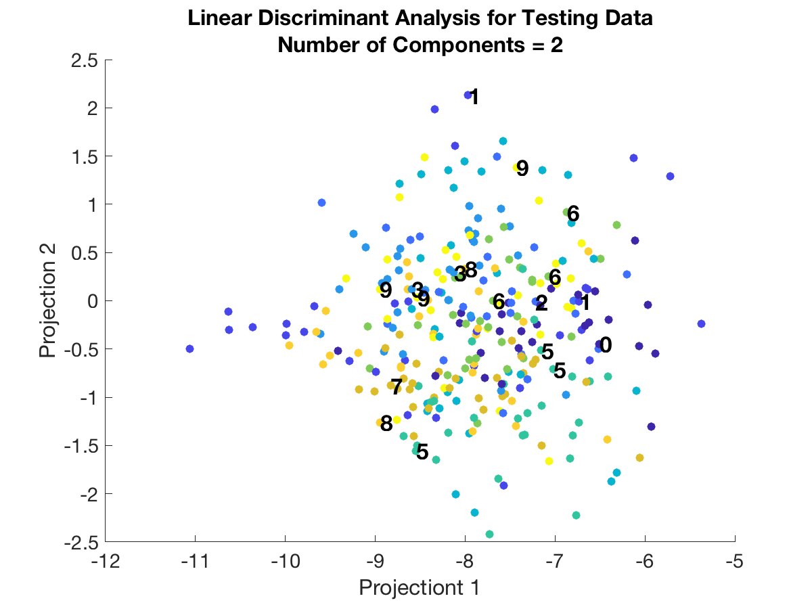
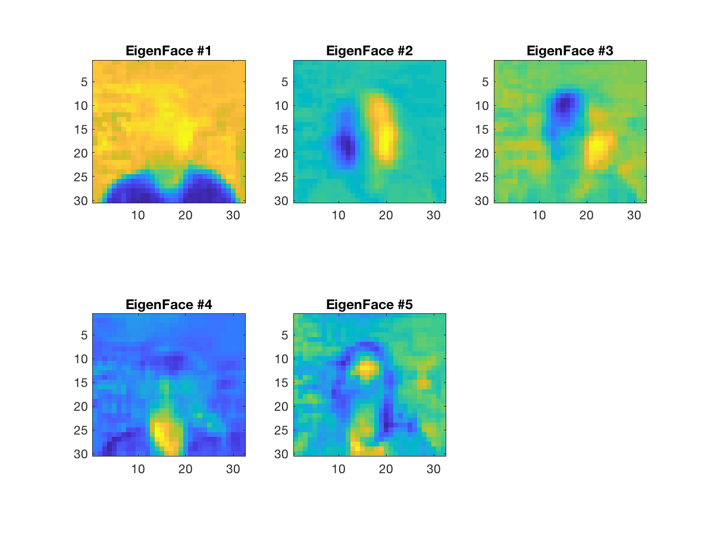
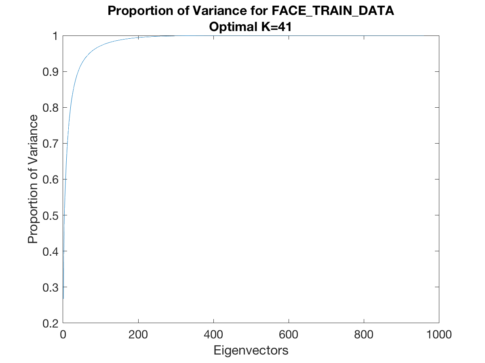
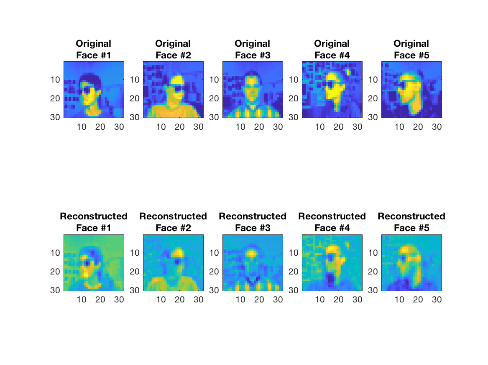
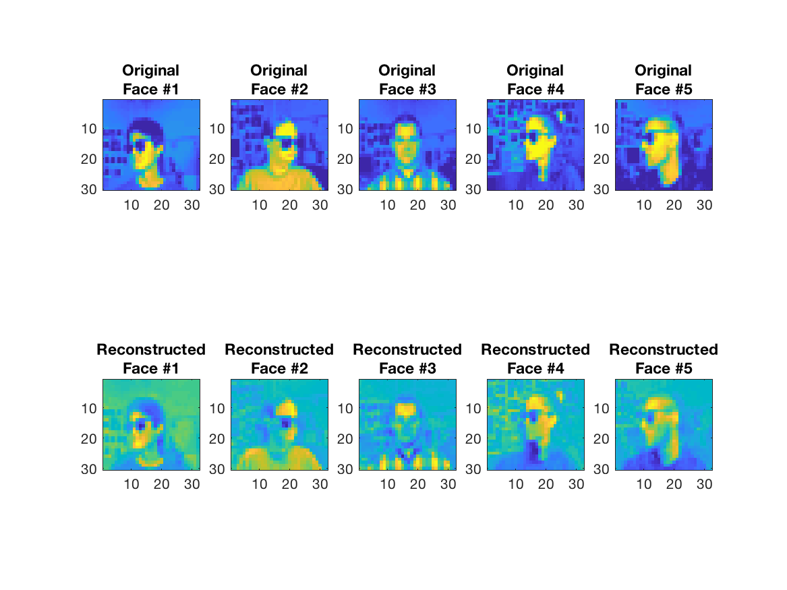

% Homework #2  
  CSCI 5521  
  Professor Kuang
% Christopher White
% March 14, 2019

# Question 1

## 1(a)
$$p(\textbf x|\Sigma_i) = \frac{1}{(2\pi)^{d/2} |\Sigma_i|^{1/2}} \exp ({-\frac{1}{2} (\textbf x - \mu_i)^T\Sigma_i^{-1}(\textbf x - \mu_i)})$$

$$\log{p(\textbf x |\Sigma_i)} = -\frac{1}{2} (\textbf x - \mu_i)^T \Sigma_i^{-1} (\textbf x - \mu_i) - \frac{d}{2} \log{2\pi} - \frac{1}{2}\log{|\Sigma_i|}$$

$$L(\Sigma_i|\textbf x^t) = \sum_{t=1}^N \log{p(\textbf x^t|\Sigma_i)}$$
$$=\sum_{t=1}^N -\frac{1}{2} (\textbf x - \mu_i)^T \Sigma_i^{-1} (\textbf x - \mu_i) - \frac{d}{2} \log{2\pi} - \frac{1}{2}\log{|\Sigma_i|}$$

$$=- \frac{N d}{2} \log{2\pi} - \frac{N}{2}\log{|\Sigma_i|} -\frac{1}{2}\sum_{t=1}^N (\textbf x - \mu_i)^T \Sigma_i^{-1} (\textbf x - \mu_i)$$

### For Model 1:
$$S_i = \frac{\sum_t r_i^t (x^t - m_i)(x^t - m_i)^T}{\sum_t r_i^t}$$

### For Model 2:
$$L(\Sigma_i|\textbf x^t)=- \frac{N d}{2} \log{2\pi} - \frac{N}{2}\log{|\Sigma_i|} -\frac{1}{2}\sum_{t=1}^N (\textbf x^t - \mu)^T \Sigma_i^{-1} (\textbf x^t - \mu)$$

$$\frac{d}{d\Sigma_i} L(\Sigma_i|\textbf x^t) = \frac{d}{d\Sigma_i} \left( - \frac{N}{2}\log{|\Sigma_i|} -\frac{1}{2}\sum_{t=1}^N (\textbf x^t - \mu)^T \Sigma_i^{-1} (\textbf x^t - \mu)\right)$$

$$=- \frac{N}{2}\frac{1}{|\Sigma_i|} |\Sigma_i| (\Sigma_i^{-T}) -\frac{1}{2} \sum_{t=1}^N \left(-\Sigma_i^{-T} (\textbf x^t - \mu) (\textbf x^t -\mu)^T \Sigma_i^{-T}\right) = 0$$

$$N \Sigma_i^{-T} =\sum_{t=1}^N \left(\Sigma_i^{-T} (\textbf x^t - \mu) (\textbf x^t - \mu)^T \Sigma_i^{-T} \right)$$

$$\Sigma_i^T N = \sum_{t=1}^N \left( (\textbf x^t - \mu) (\textbf x^t - \mu)^T \right)$$

$$\Sigma_i^T = \frac{\sum_{t=1}^N \left( (\textbf x^t - \mu) (\textbf x^t - \mu)^T \right)}{N}$$

However, $\Sigma_i^T = \Sigma_i$ because it is symmetric.

$$S_i = \frac{\sum_{t=1}^N \left( (\textbf x^t - \mu) (\textbf x^t - \mu)^T \right)}{N}$$

$$S_1 = S_2$$

$$S_1 + S_2 = 2 S = \frac{\sum_{t=1}^{N_1} \left( (\textbf x^t - \mu) (\textbf x^t - \mu)^T \right)}{N_1} +\frac{\sum_{t=1}^{N_2} \left( (\textbf x^t - \mu) (\textbf x^t - \mu)^T \right)}{N_2}$$

$$S = \frac{1}{2} (S_1+S_2)$$

### For Model 3:
$$S_i = \alpha_i I$$

$$L(\Sigma_i|\textbf x^t) = \sum_{t=1}^N \log{p(\textbf x^t|\Sigma_i)}$$

$$=- \frac{N d}{2} \log{2\pi} - \frac{N}{2}\log{|\alpha_i I|} -\frac{1}{2}\sum_{t=1}^N (\textbf x^t - \mu_i)^T \alpha_i^{-1} I (\textbf x^t - \mu_i)$$

$$\frac{d}{d\alpha_i} L(\alpha_i | \textbf x^t) = -\frac{N}{2} \frac{d}{d\alpha_i} \log{\alpha_i^d} - \frac{1}{2} \sum_{t=1}^{N} \frac{d}{d\alpha_i} (\textbf x^t - \mu_i)^T \alpha_i^{-1} (\textbf x^t - \mu_i)$$

$$= -\frac{N}{2} \frac{\textrm d}{\alpha_i} + \frac{1}{2 \alpha_i^2} \sum_{t=1}^{N} (\textbf x^t - \mu_i)^T (\textbf x^t - \mu_i) = 0$$

$$N \textrm d \alpha_i = \sum_{t=1}^{N} (\textbf x^t - \mu_i)^T (\textbf x^t - \mu_i)$$

$$\alpha_i = \frac{\sum_{t=1}^{N} (\textbf x^t - \mu_i)^T (\textbf x^t - \mu_i)}{N \textrm d}$$

DISCRIMINANT: 
$$g_i(\textbf x^t) = \log{\hat P(C_i)}-\frac{d}{2}\log{2\pi}-\frac{d}{2}
\log{\alpha_i}-\frac{1}{2\alpha_i}(\textbf x^t - m_i)^T(\textbf x^t - m_i)$$

## 1(b)
See results in MATLAB window of `MultiGaussian()`.

## 1(c)

  Model     Error Test #1     Error Test #2     ErrorTest#3
-------   ----------------   ---------------   -------------
    1           0.20             0.23              0.12
    2           0.17             0.55              0.47
    3           0.24             0.55              0.05

Table: Error Results for Test Data on 3 Models

From the table of error rates, the models each work best on a different data set. Model 2 has the lowest error for test set #1. Model 1 has the lowest error on test set #2. And model 3 has the lowest error on test set #3.

The data is test set #1 is best fit by model 2. This implies that the covariance for class 1 is close to class 2 for this data.

Test set #2 is best modeled by model 1. Model 1 makes the fewest assumptions about the covariance of the data. Since this model worked best, the data may be dependent in $\textbf x$ and has unique variances for each dimension. And the covariance is different for class 1 and class 2.

The model 3 represents data that is independent in $\textbf x$ and has the same variance for all dimensions for a given class. Since test set #3 is best fit by model 3, this indicates that the data in #3 is independent in $\textbf x$ and that a single class variance is a good approximation across the dimensions.

# Question 2

## 2(a)

    ERROR RESULTS FOR 2(A)
    ------------------
    The error rate for k=1 is: 0.053872
    The error rate for k=3 is: 0.040404
    The error rate for k=5 is: 0.043771
    The error rate for k=7 is: 0.053872

## 2(b)

    ERROR RESULTS FOR 2(B)
    ------------------
    Error rate for k=1: 0.047138
    Error rate for k=3: 0.047138
    Error rate for k=5: 0.0538721
    Error rate for k=7: 0.0538721

## 2(c)

## 2(d)

    RESULTS TABLE FOR 2(D)
    --------------
    L	k	Error
    --------------
    2	1	0.750842
    2	3	0.771044
    2	5	0.744108
    4	1	0.707071
    4	3	0.717172
    4	5	0.676768
    9	1	0.47138
    9	3	0.444444
    9	5	0.424242

## 2(e)

# Question 3

## 3(a)

## 3(b)

    ERROR RESULTS FOR 3(B)
    ------------------
    Error rate for k=1: 0.112903
    Error rate for k=3: 0.233871
    Error rate for k=5: 0.41129
    Error rate for k=7: 0.435484

## 3(c)

The results in the following three pictures show the back projected images compared to the originals. In the first graphic, the images are blurry and only vaguely look like the originals. In the second graphic, some facial features are visible as are the sunglasses. In the final graphic for K of 100, the features are more visible than K of 10 or 50. In all of the graphics there is error as the images are not as clear as the originals.

